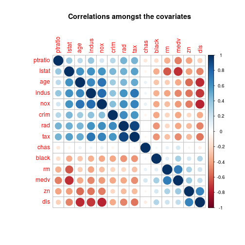
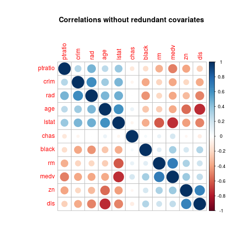
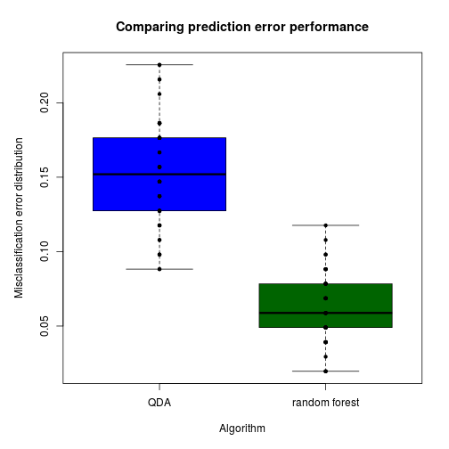

# Prompt #
This work was inspired by the exercise 13 in section 4.7 of the book 
_"An Introduction to Statistical Learning"_ by James et al, Springer NY, ISBN 978-1-4614-7137-0,
where the reader is asked to predict whether the per capita crime rate in a particular neighbourhood
of the city of Boston is above or below the median based on the information in
the data set `Boston` which can be found in the R `MASS` library.


# Inspecting the data #
Before modeling, one inspects, and if necessary, transforms the data as we now do:
One wants to know whether there are any missing values.

```r
sum (is.na (Boston))
```

```
## [1] 0
```
There are no missing values.

One also wants to identify and remove from consideration any covariates with near zero variance, since
they are non-informative.

```r
nearZeroVar (Boston)
```

```
## integer(0)
```
All covariates are informative.

One looks for excess correlation between the covariates, since this amounts to redundant information.

```r
correlations <- cor (Boston)
curmar <- par()$mar
curmar[3] <- 1.15 * curmar[3]
corrplot (correlations, order = 'hclus',
			main="Correlations amongst the covariates", mar=curmar)
```

 

We see that some covariates like `indus` show significant correlation with multiple other covariates.
Although one could use Principal Component Analysis to distill out new uncorrelated covariates, one would
do so at the cost of losing
some interpretability. Instead, we opt for the procedure outlined on page 47 of the book
_"Applied Predictive Modeling"_ by Kuhn et al, Springer NY, ISBN 978-4614-6848-6,
to identify covariates that show excess correlation with the rest of the data and drop them from consideration.
The `findCorrelation` function in the `caret` package implements this algorithm and recommends covariates for
removal.


```r
highCorr <- findCorrelation (correlations, cutoff = 0.75)
colnames (Boston)[highCorr]
```

```
## [1] "indus" "tax"   "nox"
```
Filtering out the `indus`, `tax` and `nox` columns from the data we have the following

```r
filteredBoston <- Boston[, -highCorr]
correlations <- cor (filteredBoston)
correlacurmar <- par()$mar
curmar[3] <- 1.15 * curmar[3]
corrplot (correlations, order='hclus',
          main="Correlations without redundant covariates", mar=curmar)
```

 

We see that the problem of excess correlation has been considerably mitigated.

The last prepatory step is to convert the crime rate column `crim` to a factor variable with levels
`"above"` meaning above the median, and `"below"` meaning below the median.

```r
Ntotal <- dim(filteredBoston)[1]
bostonmed <- median (filteredBoston$crim)
y <- vector ("character", length=Ntotal)
y <- sapply (1:Ntotal,
             function (i) {if (filteredBoston$crim[i] > bostonmed) "above" else "below"})

y <- as.factor (y)
y <- relevel (y, ref="below")

# Now can remove the original numeric crime rate value
filteredBoston <- filteredBoston[, -which (names(filteredBoston) == 'crim')]
```
# Performance analysis #
To quantify the predictive power of each method one proceeds as follows:

- Randomly select twenty percent of the observations as the test set, and use the remaining
eighty percent as the training set.

- Fit a QDA model to the training set.

- Fit a random forest model to the training set.

- Measure the misclassification error rate of the QDA predictor on the test set.

- Measure the misclassification error rate of the random forest predictor on the test set.

- Repeat these steps enough times to get an accurate estimate of the expected error rate.

The following code implements the above procedure.

```r
set.seed (9853)
Ntest <- ceiling (0.2 * Ntotal)
Ntrain <- Ntotal - Ntest

B <- 50
qda.err <- vector ("numeric", length=B)
rf.err <- vector ("numeric", length = B)

for (k in 1:B) {
  testind <- sample.int (n=Ntotal, size=Ntest, replace=FALSE)

  training <- filteredBoston [-testind,]
  ytrain <- y[-testind]
  testing <- filteredBoston [testind,]
  ytest <- y[testind]

  qdafit <- qda (ytrain~., data=training)
  qdaclass <- predict (qdafit, newdata=testing)$class

  qda.err[k] = mean (qdaclass != ytest)
  
  # Now fit a random forest
  rffit <- randomForest (ytrain~., data=training, ntree=100)
  rfpred <- predict (rffit, newdata=testing)
  
  rf.err[k] = mean (rfpred != ytest)
}
```

The estimated QDA prediction error and its 95% CI are:

```r
mean (qda.err) + c(0,-1,1) * sd (qda.err) * qnorm (p=0.975) / sqrt (B)
```

```
## [1] 0.152745098039 0.142800748717 0.162689447362
```
The estimated random forest prediction error and the attendant 95% CI are:

```r
mean (rf.err) + c(0,-1,1) * sd (rf.err) * qnorm (p=0.975) / sqrt (B)
```

```
## [1] 0.0607843137255 0.0545487642413 0.0670198632097
```
We see that with an error rate of about 5% the random forest method clearly outperforms
the Quadratic Discriminant Analysis method whose estimated error rate is about 15%.
This difference in performance is better visualized by comparing the distributions of
the two error sets on the following box plot.


```r
tmp <- data.frame (errors=c(qda.err, rf.err),
                   algorithm = c(rep("QDA", B), rep ("random forest", B)))
curmar <- par()$mar
curmar[2] <- 1.20 * curmar[2]
par (mar = curmar)
boxplot (errors~algorithm, data=tmp, main="Comparing prediction error performance",
         xlab="Algorithm", ylab="Misclassification error distribution",
         col=c('blue',"darkgreen"))
points (tmp$algorithm, tmp$errors, pch=20)
```

 

The distinct advantage of the random forest technique over QDA, at least on this data set, is clear.
It should be noted that we fitted the random forest without the particular fine tuning that one
could achieve by adjusting the number of random branchings per split `mtry` and by
varying the total number of trees in the forest `ntree`. Nevertheless, random forest
performs splendidly.


